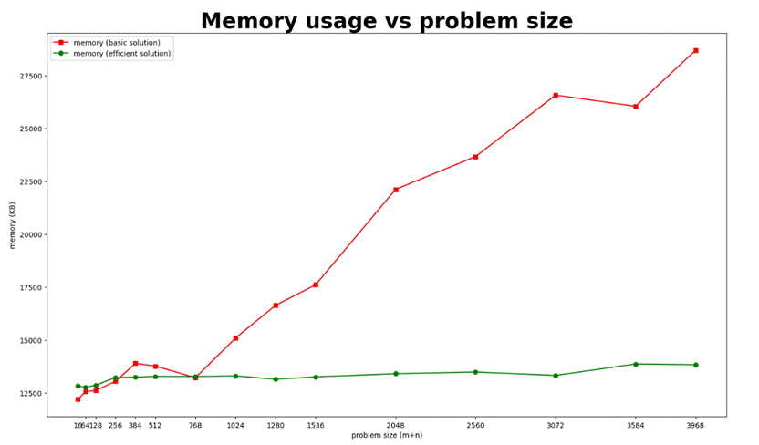
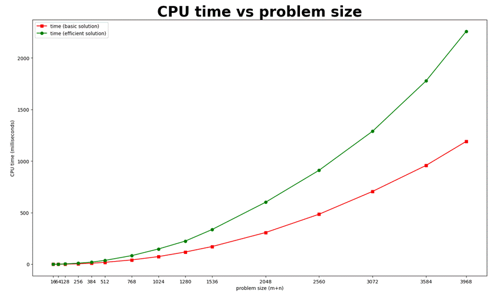

# SUMMARY

## Datapoints

| M+N  | Time  in MS (Basic) | Time  in MS (Efficient) | Memory  in KB (Basic) | Memory  in KB (Efficient) |
| ---- | ------------------- | ----------------------- | --------------------- | ------------------------- |
| 16   | 0.03170967102050781 | 0.07915496826171875     | 12208                 | 12840                     |
| 64   | 0.3237724304199219  | 0.8285045623779297      | 12572                 | 12780                     |
| 128  | 1.3420581817626953  | 2.9633045196533203      | 12620                 | 12868                     |
| 256  | 4.3354034423828125  | 10.118722915649414      | 13056                 | 13236                     |
| 384  | 9.938955307006836   | 20.600557327270508      | 13904                 | 13252                     |
| 512  | 18.713712692260742  | 37.529945373535156      | 13776                 | 13292                     |
| 768  | 41.92185401916504   | 83.86611938476562       | 13228                 | 13284                     |
| 1024 | 74.39589500427246   | 148.32162857055664      | 15104                 | 13316                     |
| 1280 | 118.67213249206543  | 224.84564781188965      | 16648                 | 13152                     |
| 1536 | 171.5564727783203   | 336.6811275482178       | 17616                 | 13268                     |
| 2048 | 307.25812911987305  | 601.140022277832        | 22124                 | 13416                     |
| 2560 | 484.9972724914551   | 911.1447334289551       | 23680                 | 13496                     |
| 3072 | 706.2840461730957   | 1289.7076606750488      | 26580                 | 13336                     |
| 3584 | 958.2674503326416   | 1777.8403759002686      | 26052                 | 13876                     |
| 3968 | 1191.0982131958008  | 2258.2690715789795      | 28700                 | 13844                     |

 

## Insights

 

### Graph1 – Memory vs Problem Size (M+N)

 

 

#### Nature of the Graph (Logarithmic/ Linear/ Polynomial/ Exponential)

Basic: polynomial

Efficient: linear

#### Explanation: 

The memory usage of the basic algorithm increases in a polynomial manner with respect to the problem size. The reason is that it uses a matrix of size m×n in the process of dynamic programming.

 

The memory usage of the efficient algorithm increases linearly with respect to the problem size. The reason is that it uses a matrix of size 2×min(m,n) in the process of dynamic programming.

###  

### Graph2 – Time vs Problem Size (M+N) 

 

 

#### Nature of the Graph (Logarithmic/ Linear/ Polynomial/ Exponential)

Basic: polynomial

Efficient: polynomial

#### Explanation: 

Both the basic algorithm and the efficient algorithm need to calculate all elements in the OPT matrix of size m×n. And each element is computed by using the recurrence formula, which takes constant time. So, they all run in polynomial time.

 

The CPU time of the efficient algorithm is nearly twice as much as that of the basic algorithm because the efficient algorithm calculates some elements in the OPT matrix multiple times. To put it more specifically, it performs the calculation 2×m×n while the basic algorithm performs the calculation m×n times.

 